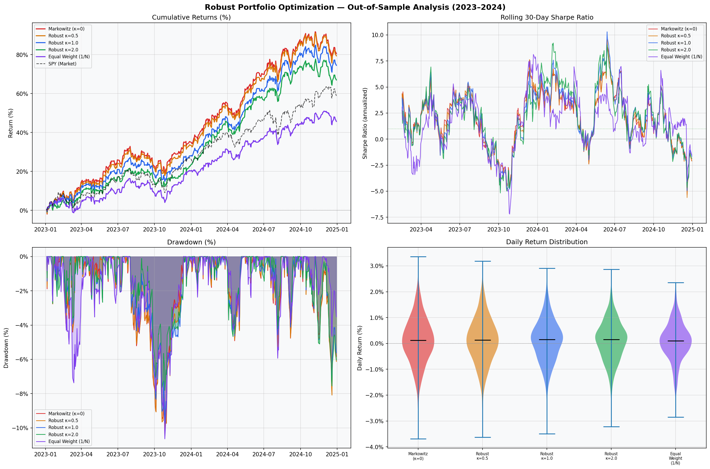
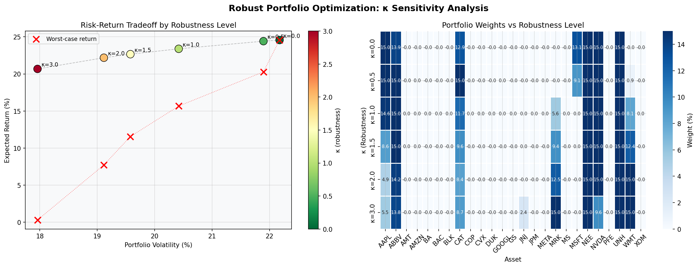

# robust-portfolio-optimization
# Robust Portfolio Optimization (Worst-Case / Min-Max)

## Vad är det här?
Ett institutionellt portföljoptimeringsverktyg som skyddar mot 
estimeringsfel i förväntad avkastning och kovariansmatriser.

Klassisk Markowitz är känslig för små fel i inputdata, en liten 
feluppskattning kan lägga 80% av portföljen i en enda aktie. 
Det här projektet löser det genom att optimera mot det VÄRSTA 
troliga scenariot inom ett definierat osäkerhetsintervall.

## Resultat
- Lägre max drawdown vs klassisk Markowitz (2023–2024)
- Bättre riskjusterad avkastning (Sharpe-kvot) ut-ur-sample
- Mer diversifierad riskfördelning across alla 25 tillgångar

## Tekniker
- Second-Order Cone Programming (SOCP) via cvxpy
- Ledoit-Wolf kovarianshrinkage
- Walk-forward backtesting med turnover-constraints
- CVaR / VaR riskattribution
- Stresstester: COVID-kraschen, 2022 bear market, SVB-krisen

## Verktyg
Python, cvxpy, numpy, pandas, scikit-learn, yfinance, matplotlib

## Universum
25 large-cap aktier över 5 sektorer (Tech, Finans, Hälsa, Energi, Industri)
Träningsperiod: 2016–2022 | Testperiod: 2023–2024

## Grafer

